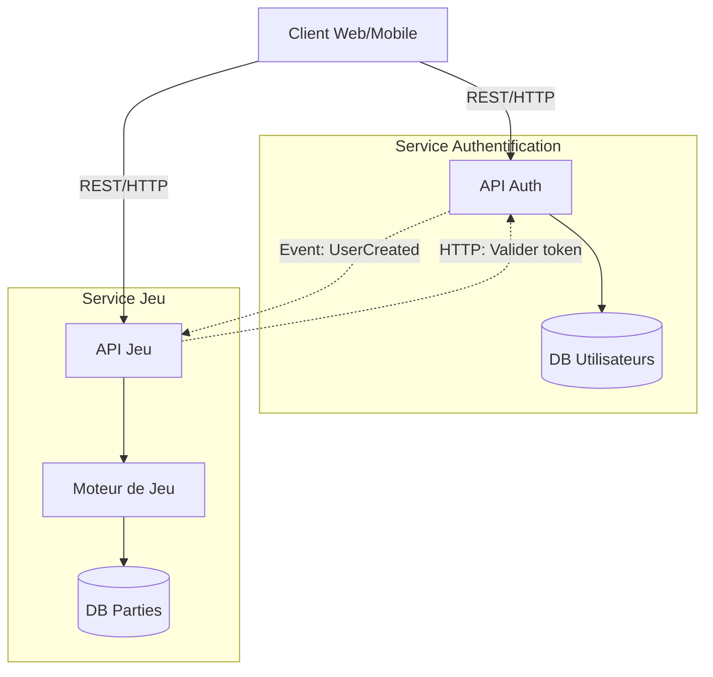
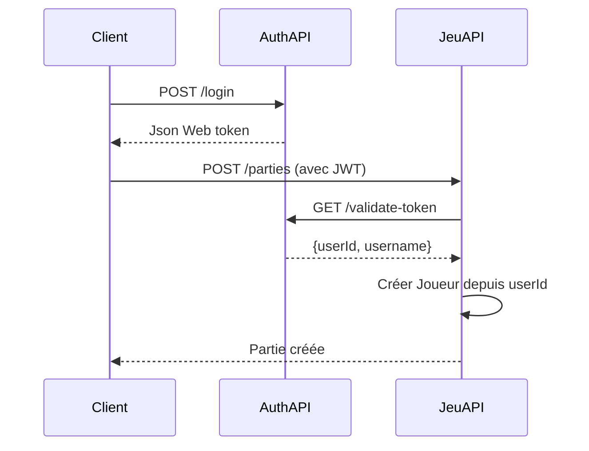

```mermaid
graph TB
    subgraph "Service Authentification"
        AuthAPI[API Auth]
        AuthDB[(DB Utilisateurs)]
        AuthAPI --> AuthDB
    end

    subgraph "Service Jeu"
        JeuAPI[API Jeu]
        MoteurJeu[Moteur de Jeu]
        JeuDB[(DB Parties)]

        JeuAPI --> MoteurJeu
        MoteurJeu --> JeuDB
    end

    Client[Client Web/Mobile] -->|REST/HTTP| AuthAPI
    Client -->|REST/HTTP| JeuAPI

    JeuAPI -.->|HTTP: Valider token| AuthAPI
    AuthAPI -.->|Event: UserCreated| JeuAPI
```

```mermaid
sequenceDiagram
    participant Client
    participant AuthAPI 
    participant JeuAPI 

%% Authentification
    Client->>AuthAPI: POST /login
    AuthAPI-->>Client: Json Web token

%% Création d'une partie
    Client->>JeuAPI: POST /parties (avec JWT)
    JeuAPI->>AuthAPI: GET /validate-token
    AuthAPI-->>JeuAPI: {userId, username}

    JeuAPI->>JeuAPI: Créer Joueur depuis userId
    JeuAPI-->>Client: Partie créée
```